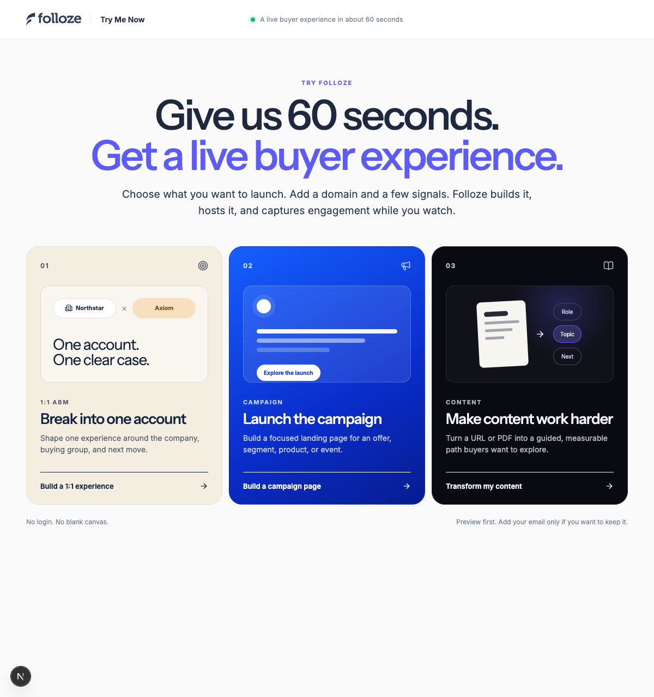

# Folloze Try Me Now

A repo-backed visual MVP for a top-of-funnel, product-led Folloze experience. A visitor chooses one of three paths, supplies a few signals, watches Folloze build in the background, and receives a tailored buyer experience within a 30–60 second quality window. The first useful build signal or provisional artifact should appear within 10 seconds.

[Open the deployed MVP](https://folloze-try-me-now.vercel.app)



## V1 paths

1. **1:1 ABM** — combine a seller domain, target account, audience, and objective into an account-specific microsite.
2. **Campaign** — build a generalized product, demand, or event landing page.
3. **Content** — turn a public URL or PDF into a guided, measurable content experience.

Every path exposes the same four intelligence layers while the visitor keeps moving:

- Brand system
- Buyer fit
- Message strategy
- Experience composition

Work begins progressively. Brand extraction starts as soon as the company domain is accepted; the app does not wait for the full brief. A temporary URL appears immediately, and an unclaimed ready preview expires after 30 minutes. Unclaimed previews stay cache-only and never trigger Folloze publication. A business email claims the experience, records the lead, and becomes the only publication boundary.

## Current checkpoint

| Surface | State |
| --- | --- |
| Local source and visual QA | Complete; desktop, mobile, 320px, reduced motion, error, claim, and signal states exercised. |
| Automated QA | 187 unit tests plus generated-experience Playwright checks cover copy, brands, responsive layouts, keyboard tabs, failure fallbacks, and lead capture. |
| Public Vercel app | Deployed at <https://folloze-try-me-now.vercel.app>. |
| Release control | Vercel is authoritative. GitHub's default branch remains `codex/visual-v1`; production tracks the intentional `production` release branch. Pinned commit and deployment evidence are recorded in [Architecture](docs/architecture.md). |
| Session durability | Connected private Vercel Blob store with uncached reads, wrapper TTL, and optimistic ETag updates. Blob remains the session store when Redis is also configured. Its current attachment spans Production, Preview, and Development; separate non-production storage and later credential rotation are tracked in [Integration readiness](docs/integration-readiness.md). |
| Brand | Brand-aware fast extractor now rejects unrelated logos and badges, ranks semantic palette roles, discovers live font faces, and selects multiple contextual visual assets; the full remote Brand Harvester is still a later option. |
| Generation | Fresh schema-constrained OpenAI generation is implemented and live-tested across ABM, demand, product, event-registration, and Content Magic. The project key remains server-only. Production promotion follows the controlled Vercel release branch and immutable-deployment verification contract. |
| Folloze | Local integration test saved unpublished Board `249022`; remote publish is disabled. |
| Email | Claim persistence works; Resend delivery is disabled, so fixture claims do not send mail. |
| Lead ledger | Neon Postgres adapter, additive migration, idempotent `session_id` upsert, and private Blob fallback are implemented. The schema is migrated and `DATABASE_URL` is attached to Vercel Preview; deployed claim readback remains a separate verification checkpoint. |

The Folloze designer URL is <https://app.folloze.com/app/board/249022/designer>. It proves a draft save only. The board is not published and has no verified anonymous URL.

## Run locally

Requirements: Node.js 22 and npm.

```bash
npm install
cp .env.example .env.local
npm run dev
```

Open <http://localhost:3000>. Integrations activate only through explicit modes, so ambient machine credentials cannot silently change behavior:

For fresh AI generation without saving project credentials in `.env.local`, keep
the OpenAI key under `com.0xtrey.folloze-try-me-now.openai`, the optional Brand
API key under `com.0xtrey.folloze-try-me-now.brandfetch`, and the Logo API client
ID under `com.0xtrey.folloze-try-me-now.brandfetch-client` in macOS Keychain, then run:

```bash
npm run dev:openai
```

That launcher reads credentials directly into the server process, forces
`GENERATION_MODE=openai`, defaults Brandfetch to logo-only mode when a client ID
exists, and never prints or persists credential values. Set
`BRANDFETCH_MODE=enrich` only after Brand API quota is active. Regular
`npm run dev` retains the explicit modes configured in your environment.

```text
GENERATION_MODE=fixture|openai
BRAND_MODE=fast|remote
FOLLOZE_MODE=disabled|draft|publish
EMAIL_MODE=console|resend
```

Claimed lead records use a pooled Neon `DATABASE_URL`. Create or verify the additive schema with:

```bash
npm run db:migrate:leads
```

Export the newest operator-facing tracking list as CSV on standard output with:

```bash
npm run db:export:leads -- --limit=500
```

The ledger stores business email, company/target domains, use case, audience, objective, source type, experience URL, and publication/email outcomes. It never stores generated HTML or source content. The export is an operator-only view of personal data and must not be committed to the repo. The email is transactional only; it does not silently subscribe the visitor to marketing.

An isolated local claim can verify the complete browser-to-Neon boundary without publishing to Folloze or sending email. Run a local server on port `3011` with fixture/disabled integrations, then run `npm run qa:claim-ledger`. The verifier refuses non-local targets and deletes its exact synthetic database and Blob records when it finishes.

Run the complete local verification suite with:

```bash
npm run qa
```

## Product and engineering references

- [Product requirements](docs/product-requirements.md)
- [Architecture](docs/architecture.md)
- [Integration readiness](docs/integration-readiness.md)
- [Observability and QA runbook](docs/observability-and-qa.md)
- [Launch plan](docs/launch-plan.md)
- [Decision log](docs/decision-log.md)
- [June 1 source recovery](docs/research/2026-06-01-source-recovery.md)
- [Folloze brand harvest](research/brand-harvest/folloze-home/brand.json)

The visual MVP deliberately separates demo proof from launch readiness. Public production still needs explicit promotion of the server-side OpenAI configuration, the narrow Folloze MCP publish gateway with anonymous readback, Resend sender, distributed abuse controls, durable workflow execution, production database binding, and operational lead-routing/retention ownership.
