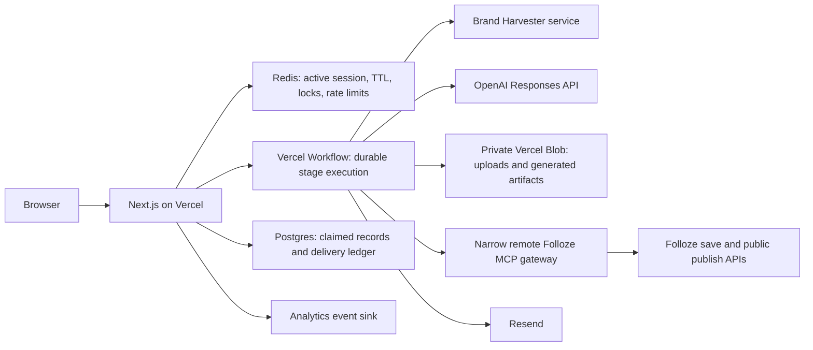

# Folloze Try Me Now technical architecture

Status: implementation contract for production hardening. A visual MVP is deployed at <https://folloze-try-me-now.vercel.app>; the target design below is not yet the deployed runtime.

## Product boundary

V1 supports three entry points:

1. **One-to-one ABM microsite**: seller company domain, target account domain, audience, and objective.
2. **Campaign landing page**: company domain, audience, objective, and campaign type. An event is a campaign type, not a fourth use case.
3. **Content experience**: company domain, audience, objective, and either a public source URL or a PDF.

The interaction contract is the same for all three:

- Create a temporary URL immediately after the company domain is accepted.
- Start the company brand harvest immediately; do not wait for the rest of the form.
- Persist each answer as it arrives and start downstream work as soon as its prerequisites exist.
- Show honest stage activity rather than a fake percentage.
- Let an unclaimed generated preview expire 30 minutes after it becomes ready.
- Claiming with a business email makes the experience durable and triggers a follow-up email containing the live URL.
- Track preview engagement and the demo CTA as first-class conversion signals.

## Current visual MVP

The existing Next.js application proves the interaction and generated experience, but several runtime paths intentionally favor a working demo over durability:

| Moment | Current behavior |
| --- | --- |
| Domain accepted | `POST /api/sessions` creates a session, mints `/e/{id}`, stores it, and schedules `runBrandStage()` with Next.js `after()`. |
| Answers arrive | `PATCH /api/sessions/{id}` merges answers. When the selected use case has enough input, it schedules `runStoryStage()` with `after()`. |
| PDF arrives | The route validates size, MIME, extension, and `%PDF-`; in explicit `GENERATION_MODE=openai` with a key it uploads the PDF to OpenAI, otherwise it retains filename metadata only. |
| Status display | The browser polls the session about every 900 ms. `/e/{id}` refreshes itself until HTML exists. |
| Session state | The deployed store is private Vercel Blob. Each session is a JSON wrapper containing the value and optional expiry; reads use `useCache:false`, expired entries are deleted on read, and updates use ETag `ifMatch` with up to five optimistic-concurrency retries. Blob takes precedence when both Blob and Redis are configured. Redis-only remains a compatibility mode but is not production-safe because its current read/mutate/write path has no atomic revision guard. Process memory is the local fallback. |
| Rate limits | Redis counters are used when Redis is configured; otherwise rate-limit buckets remain process-local memory even when sessions use Blob. |
| Brand | `BRAND_MODE=remote` plus a service URL activates the remote Brand Harvester. The deployed `fast` mode uses the bounded HTTPS extractor and then a static fallback brand on failure. |
| Story | `GENERATION_MODE=openai` plus a key activates schema-validated Responses API copy. The deployed `fixture` mode renders a deterministic draft. |
| Claim | The claim request publishes and emails synchronously. The deployed `FOLLOZE_MODE=disabled` path marks it `preview-only`; the deployed `EMAIL_MODE=console` path skips Resend delivery. |
| Operational tracing | Request operations emit correlated structured logs. Session-stage events are written only after the session commit and persist for 30 days in the private `try_me_traces` table after migration 008; browser analytics remain a separate, untrusted data stream. |
| Product analytics | Migration 009 adds a private visitor, browser-session, experience-session/input, and product-event ledger. Optional PostHog forwarding supplies analysis and masked replay; Folloze analytics remains authoritative inside published experiences. |
| Analytics | Browser and generated-page interactions remain distinct from the authoritative server trace. A committed workflow event does not prove prospect engagement, and a browser event does not prove server execution. |

`after()` is suitable for keeping work alive briefly after an HTTP response, but it is not a durable job queue. A deployment, timeout, or function failure can strand a session. Blob makes deployed sessions durable across instances and includes optimistic concurrency, but it does not provide workflow execution, scheduled expiry cleanup, distributed leases, or a permanent relational claim ledger. Redis can still provide distributed rate limits while Blob owns session state. Blob-backed operation leases are currently process-local, so external side effects still require idempotency and durable workflow fencing. The memory fallback is for local development and disappears on restart. Deterministic and preview-only fallbacks are useful for visual QA, but they must not satisfy production readiness.

Integration activation is explicit: `GENERATION_MODE`, `BRAND_MODE`, `FOLLOZE_MODE`, and `EMAIL_MODE` prevent ambient machine credentials from silently enabling providers. `TRY_ME_DEMO_MODE` is read into configuration but is not the integration gate. Production readiness must validate the explicit modes and the credentials each selected mode requires.

### Verified deployment checkpoints

| Checkpoint | Current evidence | State |
| --- | --- | --- |
| Canonical public app | <https://folloze-try-me-now.vercel.app> | Deployed visual MVP alias. |
| Deployed session persistence | Private Vercel Blob | Active; uncached reads, wrapper TTL, and ETag optimistic concurrency are implemented. |
| Generation | `GENERATION_MODE=fixture` | OpenAI generation is not active. |
| Brand | `BRAND_MODE=fast` | Safe fast extractor active; remote Brand Harvester is not active. |
| Folloze draft | Board `249022`, theme `4`, [designer](https://app.folloze.com/app/board/249022/designer) | Draft saved through the local MCP. Unpublished; no anonymous public URL is confirmed. |
| Remote Folloze publication | `FOLLOZE_MODE=disabled` | Remote MCP publication is not active. The draft checkpoint above is separate from the deployed app. |
| Transactional email | `EMAIL_MODE=console` | Resend delivery is not active. |

## Production target



### Component responsibilities

| Component | Production responsibility |
| --- | --- |
| Next.js application | Validate same-origin requests, issue the editor cookie, return the temporary URL, expose polling/read routes, and serve generated HTML. It must not perform long-running work inline. |
| Vercel Workflow | Run brand, content extraction, generation, publication, and email as durable, retryable, idempotent steps. |
| Redis | Hold active session projections, stage leases, idempotency markers, distributed rate limits, and unclaimed TTLs. Redis is not the permanent system of record for claims. |
| Private Vercel Blob | Hold uploaded PDFs, normalized brand artifacts, and versioned generated HTML. Objects are read only by trusted services or short-lived signed URLs. |
| Postgres | Persist claimed experience metadata, artifact revision, email destination, publication state, public URL, retry state, and audit timestamps. |
| Brand Harvester service | Fetch and render public company sites behind controlled egress. Return a normalized brand profile and asset references. |
| OpenAI | Produce schema-constrained copy from a compact trusted brief plus explicitly delimited untrusted source material. `store: false` remains mandatory. |
| Folloze MCP gateway | Expose only the approved Try Me Now publication operation. Resolve the trusted artifact by session and revision, save it to Folloze, publish it, and return both designer and anonymous public URLs. |
| Resend | Send one idempotent transactional email after a stable live URL exists. |
| Analytics sink | Store funnel and generated-experience events without copying page HTML, source content, or raw form data into logs. |

## Progressive workflow

### 1. Start

1. Validate and normalize `companyDomain` and `useCase`.
2. Create a high-entropy session ID and editor token. Store only the token hash; set the raw token in an `HttpOnly`, `Secure`, `SameSite=Lax` cookie scoped to session APIs.
3. Write the collecting session with a one-hour incomplete-session TTL.
4. Start the brand workflow with idempotency key `brand:{sessionId}:{revision}`.
5. Return `201` with the public session projection and `/e/{sessionId}`. Workflow completion is not on the response critical path.

If durable workflow creation fails, return a retriable error instead of displaying a session that will never progress.

### 2. Collect and generate

Every accepted material answer increments `revision`. The API evaluates prerequisites after the write:

| Use case | Generation prerequisites |
| --- | --- |
| ABM | Target domain, audience or custom audience, and objective |
| Campaign | Audience or custom audience, objective, campaign type, and event source only when type is `event` |
| Content | Audience or custom audience, objective, and a validated source URL or accepted PDF |

The generation workflow is keyed by `story:{sessionId}:{revision}`. It may reuse a finished brand artifact, wait for an active brand step, or use an explicitly recorded safe fallback after the brand step exhausts retries. Completion uses compare-and-set: a job may update the session only when its input revision is still current. Stale results remain versioned artifacts but never replace the active preview.

Generated HTML comes from a trusted server template populated with schema-validated text and normalized asset URLs. Store it as `sessions/{sessionId}/revisions/{revision}/experience.html` in private Blob. `/e/{sessionId}` resolves the active revision server-side and returns `Cache-Control: private, no-store` while unclaimed.

When the preview first reaches `preview_ready_unclaimed`, replace the remaining collecting TTL with a 30-minute expiry. A cleanup workflow deletes the unclaimed Redis projection, PDF, and generated artifacts after a short operational grace period.

The unclaimed path ends here. Brand harvest, source extraction, copy generation, rendering, and analytics preview are allowed; Folloze save and publish operations are not. Email claim is the only transition that may enter the publication workflow.

### 3. Claim, publish, and email

Claim is an idempotent durable workflow, not a long synchronous HTTP transaction:

1. Validate the business email and editor token.
2. Insert or update the Postgres lead/claim record using unique key `session_id`; copy only qualification metadata, the active experience URL/revision, and delivery state. Do not copy generated HTML or source content.
3. Remove the unclaimed deletion deadline and enqueue `claim:{sessionId}`. Return `202` with `claim_pending`.
4. Through an OpenAI Responses call with a forced MCP tool choice and explicit allowlist, ask the narrow Folloze gateway to publish `{session_id, artifact_revision, artifact_digest, idempotency_key}`.
5. Store `board_id`, `designer_url`, `public_url`, and publication timestamps. Only an anonymous public URL counts as `published`.
6. Send the email with idempotency key `try-me-claim-{sessionId}` after the stable URL exists.
7. Mark the session `claimed` and expose the live URL. Delete or age out transient Redis state after Postgres and Blob are authoritative.

Publication and email retry independently. A duplicate claim from the same email returns the existing claim state; a different email cannot take over the session. A production launch must define an operator-visible dead-letter/retry path. It must not silently convert a Folloze publication failure into `claimed` with `preview-only` status.

## API contract

The production migration should preserve the current route shapes unless a versioned API is introduced.

| Route | Request | Success | Side effect |
| --- | --- | --- | --- |
| `POST /api/sessions` | `{ useCase, companyDomain }` | `201 { session }`, editor cookie | Writes session and starts brand workflow. |
| `GET /api/sessions/{id}` | None | `200 { session }`; `410` after expiry | Reads the safe public projection only. |
| `PATCH /api/sessions/{id}` | Partial answer object plus current `revision` or `If-Match` | `200 { session }`; `409` on stale revision | Persists answers and may start generation. |
| `POST /api/sessions/{id}/upload` | One PDF, maximum configured bytes | `202 { session, upload }` | Stores privately, scans/parses, and may start generation. |
| `POST /api/sessions/{id}/claim` | `{ email }` | `202 { session, claim }`; idempotent replay is `200` or the same `202` | Persists claim and starts publish/email workflow. |
| `GET /e/{id}` | None | `200` generated HTML, `202` preparing page, or `410` expired | Resolves only the session's active trusted artifact. |
| `POST /api/events` | Allowlisted event name and minimal context | `202` | Writes analytics after origin, session, and rate checks. |
| `GET /api/health` | None | Liveness only | Must not expose secrets or imply launch readiness. |

All mutation routes require the editor cookie, except initial session creation. Responses never contain the editor token hash, raw claim email, OpenAI file ID, private Blob URL, source content, or generated HTML. Errors use a stable machine code plus safe display text and a request ID.

## State contract

The browser consumes a projection of the following target state:

```text
collecting
  -> generating
  -> preview_ready_unclaimed
  -> claim_pending
  -> publishing
  -> claimed

generating -> generation_failed -> generating
claim_pending|publishing -> claim_failed -> claim_pending
collecting|preview_ready_unclaimed -> expired
```

Stage status remains independent from top-level status: `brand`, `audience`, and `story` are each `pending`, `running`, `complete`, `fallback`, or `failed` with timestamps and a safe human-readable detail.

Required invariants:

- Session and workflow IDs are opaque and unguessable.
- A stage runs at most once concurrently for one session revision, and all external writes are idempotent.
- A workflow result cannot overwrite a newer revision.
- `temporaryUrl` always points at the app; `liveUrl` is set only after the claim has a durable destination.
- `published` means Folloze returned an anonymous public URL, not merely a designer URL.
- Unclaimed artifacts expire; claimed metadata does not depend on Redis persistence.
- Raw email remains server-side and is masked in every browser response.

## Folloze integration contract

The configured local Folloze MCP and production publishing are different capabilities.

The local MCP is a profile-isolated, stdio process using a user's local OAuth state. Its save tools create or update Folloze board configuration and return a designer URL. That is a **draft save**. It does not prove the board is published or anonymously reachable, and the local launcher, token cache, and filesystem are not deployable to Vercel.

The campaign-factory reference flow proves that a public board requires additional Folloze operations: create the board, mark the Prism board public, save its configuration, invoke publish, and read back the public URL. A production Try Me Now tool must own that complete sequence and verify anonymous reachability before returning `status: "published"`.

The remote gateway exposes one allowlisted operation, currently named `create_try_me_experience`, with this boundary:

```json
{
  "session_id": "opaque session id",
  "artifact_revision": 7,
  "artifact_digest": "sha256 hex digest",
  "idempotency_key": "claim:opaque session id"
}
```

It must reject arbitrary HTML, arbitrary fetch URLs, user-selected Folloze tool names, and model-supplied credentials. The gateway authenticates the caller, loads the approved artifact from private storage, verifies its digest and revision, applies an approved theme, publishes idempotently, and returns a strict response whose `public_url` host is allowlisted by the app:

```json
{
  "status": "published",
  "board_id": "247000",
  "designer_url": "https://...",
  "public_url": "https://...",
  "artifact_revision": 7,
  "artifact_digest": "sha256 hex digest",
  "warnings": []
}
```

`already_published` is a valid idempotent replay only when it returns the same board and artifact revision. Any other status is a publication failure.

## Security contract

- **SSRF:** allow only public HTTPS destinations with no credentials or custom ports. Revalidate every redirect. The production fetcher must protect against DNS rebinding by enforcing the resolved destination at connection time and blocking all private, loopback, link-local, multicast, carrier-grade NAT, metadata-service, and reserved IPv4/IPv6 ranges.
- **Uploads:** keep PDFs private, validate MIME and magic bytes, cap size, scan before parsing, sandbox extraction, and delete both Blob and OpenAI file objects on expiry. Filenames and document text are untrusted input.
- **Prompt injection:** delimit all harvested/source text as data, never expose publication tools during copy generation, require structured output, and render only through the trusted template.
- **Session integrity:** hash editor tokens, use constant-time comparison, enforce origin checks on mutations, add distributed rate limits, and use Turnstile on abusive create/claim traffic. Rotate a session token after claim if the app retains editing.
- **Publication:** use short-lived workload identity or a rotated service secret between the app and gateway. Enforce tool allowlists, replay protection, idempotency, request-size limits, and an artifact digest check.
- **Rendering:** escape all generated text and allowlist asset protocols and hosts. Replace permissive inline-script CSP with nonces or hashes where practical. Never accept model-generated executable code.
- **Privacy:** never log raw email, source content, PDF bytes, generated HTML, cookies, OpenAI file IDs, or integration tokens. Define explicit retention for claimed and unclaimed data and publish it in user-facing privacy copy.
- **Abuse and cost:** cap sessions per client and domain, generation attempts per session, upload bytes, workflow duration, OpenAI tokens, and Folloze publishes. Alert on unusual error, spend, and claim patterns.

## Environment contract

Production configuration is server-only unless prefixed `NEXT_PUBLIC_`. Secrets must be separate across preview and production deployments.

| Variable | Required for production | Contract |
| --- | --- | --- |
| `NEXT_PUBLIC_APP_URL` | Yes | Canonical HTTPS origin used for app URLs and origin validation. |
| `GENERATION_MODE` | Yes | Explicitly set `openai`; a key alone must not activate generation. |
| `BRAND_MODE` | Yes | Explicitly select `remote` or approve `fast` as degraded production behavior. |
| `FOLLOZE_MODE` | Yes | Set `publish` for the production claim path; `draft` and `disabled` cannot satisfy public publication. |
| `EMAIL_MODE` | Yes | Explicitly set `resend`; ambient credentials must not activate delivery. |
| `OPENAI_API_KEY` | Yes | Project-scoped key with budget and rotation policy. Never exposed to the browser. |
| `OPENAI_MODEL` | Yes | Pinned supported model used for structured generation and MCP invocation. |
| `UPSTASH_REDIS_REST_URL`, `UPSTASH_REDIS_REST_TOKEN` | Yes | Shared active-session, lock, TTL, and rate-limit store. |
| `BLOB_READ_WRITE_TOKEN` | Yes | Private upload and versioned artifact storage. |
| `DATABASE_URL` | Yes | Postgres connection for claimed records, publish ledger, and delivery state. |
| `BRAND_HARVESTER_URL`, `BRAND_HARVESTER_TOKEN` | Yes for full-fidelity launch | Authenticated controlled-egress brand service. The fast extractor may remain an explicit degraded mode. |
| `FOLLOZE_MCP_SERVER_URL`, `FOLLOZE_MCP_AUTH_TOKEN` | Yes | Remote narrow gateway and service credential. |
| `FOLLOZE_MCP_TOOL_NAME` | Yes | Deployment allowlist value; expected `create_try_me_experience`. |
| `FOLLOZE_THEME_ID`, `FOLLOZE_THEME_URL` | Yes when a fixed theme is required | Gateway theme identity and trusted template asset URL; validate consistency at startup. |
| `RESEND_API_KEY`, `EMAIL_FROM` | Yes | Transactional email credentials and a verified sending identity. |
| `EMAIL_REPLY_TO` | Recommended | Monitored reply destination. |
| `TRY_ME_SESSION_TTL_SECONDS` | Yes | Unclaimed ready-preview TTL; production value `1800`. |
| `TRY_ME_MAX_PDF_BYTES` | Yes | Upload cap; V1 value `10485760`. |
| `TRY_ME_DEMO_MODE` | No integration role | Currently a product/demo configuration value. Do not use it to infer provider activation or launch readiness. |
| `NEXT_PUBLIC_DEMO_CTA_URL` | Yes | Approved demo destination tracked as the primary CTA conversion. |
| `NEXT_PUBLIC_TURNSTILE_SITE_KEY`, `TURNSTILE_SECRET_KEY` | Recommended before public traffic | Abuse challenge, enabled according to risk thresholds. |

Workflow and Blob vendor-provided variables should retain their platform names. Do not copy local Folloze OAuth profiles, cookies, or token files into deployment variables.

## Launch acceptance gates

Production is ready only when all of these pass in a Vercel preview environment configured like production:

1. Domain submission returns a usable temporary URL quickly and a killed function does not stop the brand workflow.
2. Concurrent answer patches cannot let an old generation overwrite a newer revision.
3. An unclaimed ready preview returns `410` after 30 minutes and its private artifacts are removed within the retention grace window.
4. Claim survives a deployment/restart, publishes exactly one Folloze board, and emails exactly once under retries.
5. The returned Folloze URL works in an anonymous browser. A designer URL alone fails the test.
6. Redirect, DNS-rebinding, private-network, oversized/malformed PDF, prompt-injection, token-replay, and rate-limit tests pass.
7. Funnel events reach the analytics sink with request/session correlation and no restricted payloads.
8. Readiness fails closed when an explicit production mode lacks its required OpenAI, Redis, Blob, Postgres, Folloze publication, or Resend dependency.
